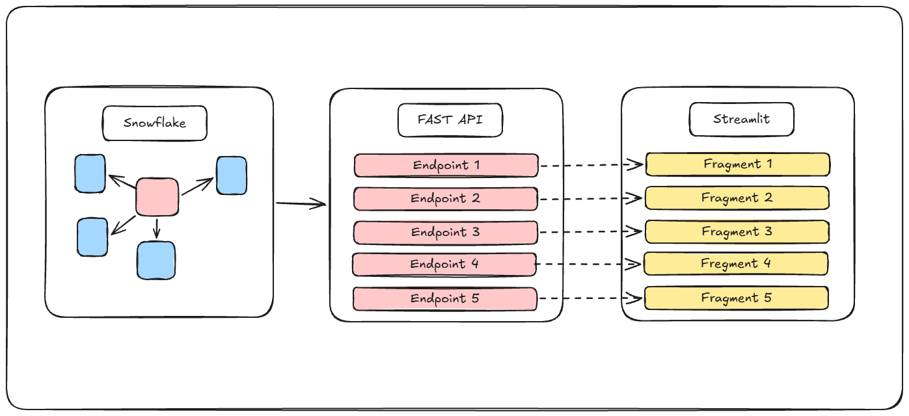
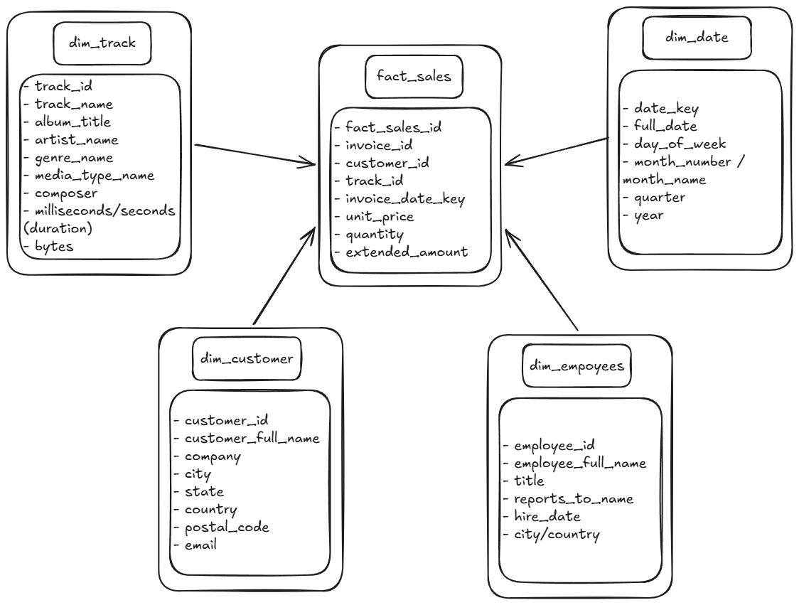

# Chinook Analytics Platform

This project is a three-tier data analytics platform that provisions a Snowflake data warehouse, serves data via a FastAPI backend, and visualizes insights using a Streamlit frontend.



## Database Architecture

The platform analyzes the well-known Chinook dataset (a digital music store). The data has been processed through a pipeline and loaded into Snowflake as a star schema optimized for analytical queries.

As shown in the architecture diagram, the model centers on a `fact_sales` table containing transactional data, surrounded by four dimension tables:

* `dim_track`: Information about songs, albums, artists, and genres.
* `dim_customer`: Customer demographic and location data.
* `dim_employees`: Employee hierarchy and reporting structures.
* `dim_date`: Date dimension for time-series analysis.



## Prerequisites

Before you begin, ensure you have the following installed and configured:

* **Python** with **uv** (for dependency management)
* **Terraform** (for infrastructure as code)
* **AWS CLI** (configured and authenticated for the S3 backend)
* A **Snowflake** account with appropriate admin privileges

---

## 1. Infrastructure Layer (Snowflake & Terraform)

This layer sets up the Snowflake database and loads the initial CSV data.

**1. Generate RSA Keys for Snowflake:**
Snowflake requires an RSA key pair for secure API authentication. Generate these locally (Linux/macOS):

```bash
# Generate the unencrypted private key (keep this safe!)
openssl genrsa 2048 | openssl pkcs8 -topk8 -inform PEM -out rsa_key.p8 -nocrypt

# Extract the public key
openssl rsa -in rsa_key.p8 -pubout -out rsa_key.pub

```

*Note: Save these files in the `infrastructure/` folder and ensure they are added to your `.gitignore`.*

**2. Configure Snowflake:**
Assign the public key to your Snowflake user by executing this SQL command in your Snowflake worksheet:

```sql
ALTER USER your_user SET RSA_PUBLIC_KEY='<contents_of_rsa_key.pub>';

```

**3. Configure Environment Variables:**

* Rename `.env.example` to `.env`.
* Rename `terraform.tfvars.example` to `terraform.tfvars`.
* Rename `backend.hcl.example` to `backend.hcl` (update with your specific AWS S3 bucket details).

**4. Provision Infrastructure:**

```bash
cd infrastructure

# Sync dependencies and activate the environment
uv sync
source .venv/bin/activate

# Initialize Terraform with your S3 backend
terraform init -backend-config="backend.hcl"

# Review and apply the infrastructure plan
terraform plan
terraform apply

# Run the initialization script to load the CSV data
uv run python scripts/init_db.py

```

---

## 2. API Layer (FastAPI)

The API layer connects to Snowflake using the RSA keys and serves the data to the frontend.

**1. Configuration:**

* Copy your `rsa_key.p8` file from the infrastructure step into the root of the `ApiLayer/` folder.
* Rename `.env.example` to `.env` and fill in your Snowflake connection details.

**2. Run the API:**

```bash
cd ../ApiLayer

# Sync dependencies and activate the environment
uv sync
source .venv/bin/activate

# Start the FastAPI server
uv run fastapi dev main.py

```

---

## 3. Presentation Layer (Streamlit)

The presentation layer is a lightweight Streamlit application that consumes the FastAPI endpoints to visualize the data. It requires no secret management.

**1. Run the Dashboard:**

```bash
cd ../PresentationLayer

# Sync dependencies and activate the environment
uv sync
source .venv/bin/activate

# Launch the Streamlit app
uv run streamlit run app.py

```
